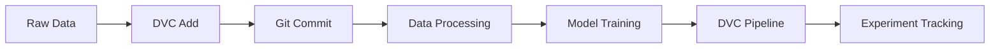

# 🌍 Air Quality Predictor with DVC

<div align="center">


*A machine learning project to predict Air Quality Index (AQI) while learning Data Version Control (DVC) best practices*

</div>

---

## 📋 Table of Contents

- [🎯 Project Objectives](#-project-objectives)
- [🔍 Project Overview](#-project-overview)
- [🏗️ Project Structure](#️-project-structure)
- [📊 Dataset Information](#-dataset-information)
- [🛠️ Technology Stack](#️-technology-stack)
- [⚙️ Installation & Setup](#️-installation--setup)
- [🚀 Usage](#-usage)
- [📈 DVC Workflow](#-dvc-workflow)
- [🔧 Essential DVC Commands](#-essential-dvc-commands)
- [📋 DVC Pipeline](#-dvc-pipeline)
- [🤖 Model Performance](#-model-performance)
- [🎓 Learning Outcomes](#-learning-outcomes)
- [🤝 Contributing](#-contributing)
- [📄 License](#-license)

---

## 🎯 Project Objectives

### Primary Goal
**Master Data Version Control (DVC)** through hands-on implementation in a real-world machine learning project.

### Learning Objectives
- ✅ **Data Versioning**: Track and manage dataset changes over time
- ✅ **Pipeline Management**: Create reproducible ML pipelines with DVC
- ✅ **Experiment Tracking**: Compare different model versions and hyperparameters
- ✅ **Collaboration**: Share datasets and models efficiently across teams
- ✅ **Storage Optimization**: Handle large datasets without bloating git repositories

### Secondary Goal
Build an accurate **Air Quality Index (AQI) prediction model** using environmental factors.

---

## 🔍 Project Overview

This project combines environmental data analysis with modern MLOps practices, specifically focusing on **Data Version Control (DVC)**. We predict Air Quality Index values using various environmental parameters while demonstrating industry-standard data and model versioning techniques.

### Why This Project?
- **Real-world Problem**: Air quality prediction has significant environmental and health implications
- **DVC Learning**: Perfect complexity level for understanding DVC concepts
- **Reproducibility**: Demonstrates how DVC ensures reproducible ML workflows
- **Scalability**: Shows how to manage growing datasets and evolving models

---

## 🏗️ Project Structure

```
air-quality-predictor/
├── 📁 data/                          # Data directory (DVC tracked)
│   └── data.csv                      # Air quality dataset
├── 📁 src/                           # Source code
│   ├── train.py                      # Model training script
│   ├── data_change.py                # Data augmentation utilities
│   └── dr.py                         # Data deduplication script
├── 📁 DVC_output/                    # DVC cache and metadata
│   └── files/                        # DVC internal files
├── 📄 data.dvc                       # DVC data tracking file
├── 📄 requirements.txt               # Python dependencies
└── 📄 README.md                      # Project documentation
```

---

## 📊 Dataset Information

### Dataset Overview
- **Target Variable**: AQI (Air Quality Index)
- **Features**: Environmental parameters affecting air quality
- **Format**: CSV file managed by DVC
- **Size**: ~128KB with multiple environmental measurements

### Data Processing Pipeline
1. **Raw Data Ingestion** → Load original air quality measurements
2. **Data Augmentation** → Expand dataset using `data_change.py`
3. **Deduplication** → Remove duplicate entries using `dr.py`
4. **Version Control** → Track all changes with DVC

---

## 🛠️ Technology Stack

<div align="center">

| Category | Technologies |
|----------|-------------|
| **Language** |  |
| **ML Libraries** |    |
| **Visualization** |  |
| **Version Control** |   |

</div>

---

## ⚙️ Installation & Setup

### Prerequisites
- Python 3.8+
- Git
- DVC

### Step-by-Step Setup

1. **Clone the Repository**
   ```bash
   git clone https://github.com/adnan-qazii/air-quality-predictor.git
   cd air-quality-predictor
   ```

2. **Install Python Dependencies**
   ```bash
   pip install -r requirements.txt
   ```

3. **Initialize DVC (if needed)**
   ```bash
   dvc init
   ```

4. **Pull Data from DVC**
   ```bash
   dvc pull
   ```

---

## 🚀 Usage

### Quick Start

1. **Data Processing**
   ```bash
   # Augment dataset
   python src/data_change.py
   
   # Remove duplicates
   python src/dr.py
   ```

2. **Model Training**
   ```bash
   python src/train.py
   ```

3. **Track Changes with DVC**
   ```bash
   dvc add data/data.csv
   git add data.dvc .gitignore
   git commit -m "Update dataset version"
   ```

---

## 📈 DVC Workflow

### Our DVC Learning Journey



### Key DVC Concepts Demonstrated

1. **Data Tracking**: Version control for datasets
2. **Pipeline Creation**: Reproducible ML workflows
3. **Remote Storage**: Efficient data sharing
4. **Experiment Management**: Compare model versions

---

## 🔧 Essential DVC Commands

### Basic DVC Operations

```bash
# Initialize DVC in your project
dvc init

# Add data to DVC tracking
dvc add data/data.csv

# Commit the DVC file to git
git add data.dvc .gitignore
git commit -m "Add dataset to DVC"

# Push data to remote storage
dvc push

# Pull data from remote storage
dvc pull

# Check DVC status
dvc status

# Show data information
dvc data status
```

### Advanced DVC Features

```bash
# Create a DVC pipeline
dvc run -n prepare_data \
        -d src/data_change.py \
        -d data/raw_data.csv \
        -o data/processed_data.csv \
        python src/data_change.py

# Run the entire pipeline
dvc repro

# Compare experiments
dvc plots show

# Track metrics
dvc metrics show

# Create experiment branches
dvc exp run

# Compare experiments
dvc exp show
```

### Data Management Commands

```bash
# Remove data from DVC tracking
dvc remove data.dvc

# Import data from URL
dvc import-url https://example.com/data.csv data/external_data.csv

# Get data from another DVC project
dvc get https://github.com/example/repo data/dataset.csv

# List tracked data
dvc list . data/

# Show data size and statistics
dvc data status -v
```

### Pipeline Management

```bash
# Visualize pipeline
dvc dag

# Force pipeline reproduction
dvc repro --force

# Run specific pipeline stage
dvc repro stage_name

# Pipeline with parameters
dvc run -n train \
        -p train.learning_rate,train.epochs \
        -d src/train.py \
        -d data/processed_data.csv \
        -o models/model.pkl \
        -M metrics/train_metrics.json \
        python src/train.py
```

### Experiment Tracking

```bash
# Start new experiment
dvc exp run -S train.learning_rate=0.01

# Compare experiments
dvc exp diff

# Show all experiments
dvc exp show --include-params=*

# Apply successful experiment
dvc exp apply exp-name

# Remove experiment
dvc exp remove exp-name
```

---

## 📋 DVC Pipeline

### Pipeline Structure

```yaml
# dvc.yaml (example pipeline configuration)
stages:
  prepare_data:
    cmd: python src/data_change.py
    deps:
    - src/data_change.py
    - data/raw_data.csv
    outs:
    - data/processed_data.csv

  remove_duplicates:
    cmd: python src/dr.py
    deps:
    - src/dr.py
    - data/processed_data.csv
    outs:
    - data/clean_data.csv

  train_model:
    cmd: python src/train.py
    deps:
    - src/train.py
    - data/clean_data.csv
    outs:
    - models/model.pkl
    metrics:
    - metrics/train_metrics.json
```

---

## 🤖 Model Performance

### Current Model Architecture
- **Algorithm**: Random Forest Regressor
- **Features**: Environmental parameters
- **Target**: Air Quality Index (AQI)
- **Preprocessing**: StandardScaler normalization

### Performance Metrics
- **R² Score**: Coefficient of determination
- **MSE**: Mean Squared Error
- **Cross-validation**: Train/test split validation

### Model Tracking with DVC
```bash
# Track model performance
dvc metrics show metrics/train_metrics.json

# Compare model versions
dvc plots show metrics/performance.json
```

---

## 🎓 Learning Outcomes

### DVC Skills Acquired

✅ **Data Versioning**
- Track large datasets efficiently
- Manage data changes over time
- Share datasets across teams

✅ **Pipeline Management**
- Create reproducible workflows
- Automate ML pipeline execution
- Handle dependencies correctly

✅ **Experiment Tracking**
- Compare model performance
- Track hyperparameter changes
- Manage experiment lifecycle

✅ **Collaboration**
- Share models and data safely
- Maintain project reproducibility
- Handle merge conflicts in ML projects

### Best Practices Learned

1. **Always commit DVC files to git**
2. **Use meaningful commit messages**
3. **Track both data and code changes**
4. **Document pipeline dependencies**
5. **Regular experiment comparisons**

---

## 🤝 Contributing

We welcome contributions to improve this learning project!

### How to Contribute

1. **Fork the repository**
2. **Create a feature branch**
   ```bash
   git checkout -b feature/your-feature-name
   ```
3. **Make your changes**
4. **Update DVC tracking if needed**
   ```bash
   dvc add data/your-new-data.csv
   ```
5. **Commit your changes**
   ```bash
   git add .
   git commit -m "Add: your contribution description"
   ```
6. **Push and create a Pull Request**

### Contribution Areas
- 📊 Data preprocessing improvements
- 🤖 Model architecture enhancements
- 📈 Visualization additions
- 📚 Documentation improvements
- 🔧 DVC pipeline optimizations

---

## 📄 License

This project is licensed under the MIT License - see the [LICENSE](LICENSE) file for details.

---

<div align="center">

### 🌟 Star this repository if it helped you learn DVC!

**Happy Learning! 🚀**

*Built with ❤️ for the ML community*

</div>